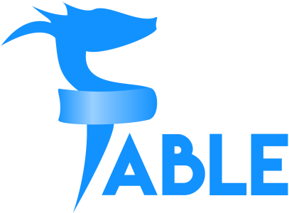

- title : F# |> DNN
- author : Stefan Cullmann
- theme : night
- transition : default

***

## F# |> DNN

<br />
<br />

### Experiences in using F# for DNN

<br />
<br />
Stefan Cullmann - [@scullman](http://www.twitter.com/scullman)

Berlin, Germany

***

### My DNN Resume

* former DNN Core Team Member,
* DNN MVP in 2017
* I did a few WebForm modules, e.g.
    * User Defined Table / Form and List,
    * Xml Module,
* was involved in a few core changes, e.g.
    * Token Replace
* and did a few talks
    * Open-Force, Dnn-Europe, Dnn-Connect

---

### My daily business

* Head of IT (small team)
* 100% inhouse development
    * Training & qualification in the field of Non-Destructive Testing
    * Certification
    * Conferences and Seminars
* Sometimes PO, sometimes architect, less often developer

---

### Shift of Interests

* Focus on solving problems
   * (formerly) by writing code: apps, modules
* Exploring and analysing the business domain
* Adapting and improving business processes
* Applying DDD methods
    * CQRS/ES
    * Event Storming


---
### Lessons learned 

* DNN is an awesome application host
* Put separate concerns/ bounded contexts into own modules
* Avoid dependencies, especially to DNN
    * put them into its own assembly
    * decouple as much as possible
* DRY is often  harmful

---

### Lessons learned 
#### ... outside the core domain

* Try to avoid coding
* Use existing tools wherever reasonable, e.g.
   * 2sxc Content, 
   * Open Content, 
   * DNN-Sharp tools,
   * Liquid Content,
   * (Form and List)
   * Add your favourite tool ....

---

### Lessons learned    
#### ... within the core domain

* Software development is a learning process,    
working code is a side effect
* Focus on the core domain
* Keep the implementation as close as possible to your understanding


---
### Disclaimer

 

 * I am not an F# Expert or Evangelist

***


## F# Basics

---

* General purpose programming language
* Functional-*first*
* Powerful type system
* Awesome data manipulation capabilities
* Leads to the "pit of success"

---

#### The Mountain of Doom


---

#### The Pit of Success


---

| C# / VB .NET | F#
|-:|:-
| Mutable by default | Immutable by default
| Side-effects + statements | Expressions
| Classes | Functions as values
| Inheritance | Composition
| State | Data + pure functions
| Polymorphism | Algebraic Data Types

---

## What does it mean?

1. It is easy to learn
1. It is **very** typesafe
1. It encorurages experimentation
1. It can be very intuitive
1. It shuns ceremony
1. Easier to test
1. Very friendly Community
1. It will open your mind to possibilities

Source: [Eight reasons to learn F#](https://medium.com/real-world-fsharp/eight-reasons-to-learn-f-fcb2bef64d7a)

---

## F# Primer in < 5 minutes

---

### Values

```fsharp
// bind 5 to x
let x:int = 5

// type inference
let inferredX = 5

// functions are just values, don't need a class
let helloWorld(name) = sprintf "Hello, %s" name 

// type inference again
let text = helloWorld "DNN-Summit"
```

---

### Types

```fsharp
open System

// Tuples are first class citizens in F#
let person = Tuple.Create("Stefan", 50)
let personShortHand = "Stefan", 50 // string * int
let name, age = personShortHand // decompose the tuple 

// Declaring a record
type Person = { Name : string; Age : int }

// Create an instance
let me = { Name = "Stefan"; Age = 50 }
printfn "%s is %d years old" me.Name me.Age
```
---

### Immutable by default

```fsharp
let a = 10
//a <- 20 // not allowed

let mutable y = 10 // need an extra keyword!
y <- 20 // ok 

let me = { Name = "Stefan"; Age = 50 }
//me.Age <- 20 // not allowed

//creates a new record based on an existing one
let youngerme = {me with Age = 20} 
```
--- 
### Classes

```fsharp
// Declaring a class
type Person (name:string, age:int)  =
    member val Name = name with get, set //auto properties 
    member val Age  = age  with get, set

let me = Person (Stefan, 50)
me.Age <- 20 // allowed
```

---

### More Types

```fsharp
open FSharp.Data.UnitSystems.SI.UnitSymbols

type Direction = North | South | East | West
type Weather =
    | Cold of temperature:float<C>
    | Sunny
    | Wet
    | Windy of Direction * windspeed:float<m/s>

// Create a weather value
let weather = Windy(North, 10.2<m/s>)

let (|Low|Medium|High|) speed =
    if speed > 10.<m/s> then High
    elif speed > 5<m/s>. then Medium
    else Low
```
---

### Exhaustive pattern matching

```fsharp
match weather with
| Cold temp when temp < 2.0<C> -> "Really cold!"
| Cold _ | Wet -> "Miserable weather!"
| Sunny -> "Nice weather"
| Windy (North, High) -> "High speed northernly wind!"
| Windy (South, _) -> "Blowing southwards"
| Windy _ -> "It's windy!"
```

---

### Pipelines

*Top ten most most popular counties for house sales*


---

### Asynchronous support

```fsharp
open System
open System.Net

let webPageSize = async {
    use wc = new WebClient()
    let! result = wc.AsyncDownloadString(Uri "http://www.dnn-connect.org")
    return result.Length }
```

---

### No nulls!


---

### Attention!


---

### Whitespace sensitive 

```fsharp
open System
    
let prettyPrintTime() =
    let time = DateTime.UtcNow
    printfn "It is now %d:%d" time.Hour time.Minute
```
---

### Equals is comparison!

```fsharp
let x = 5
x = 10 // false, COMPARISON!!!
```
---

### REPL

* Read, Evaluate, Print Loop
* No console applications needed
* Scripts
* Explore domain quickly
* Converts quickly to full-blown assemblies

***


## Fable

---

### Fable
* Fable is an F# to JavaScript compiler powered by Babel
* <a href="http://fable.io/repl" target="_blank">REPL</a>

---

*** 


## Fable-Elmish

<br/><br/>
#### Build Fable apps following the Elm architecture (Model View Update)

---
### Model - View - Update

#### "Elm - Architecture"

 


 <small>http://danielbachler.de/2016/02/11/berlinjs-talk-about-elm.html</small>


--- 

### Model - View - Update

    // MODEL

    type Model = int

    type Msg =
    | Increment
    | Decrement

    let init() : Model = 0

---

### Model - View - Update

    // VIEW

    let view model dispatch =
        div []
            [ button [ OnClick (fun _ -> dispatch Decrement) ] [ str "-" ]
              div [] [ str (model.ToString()) ]
              button [ OnClick (fun _ -> dispatch Increment) ] [ str "+" ] ]

---

### Model - View - Update

    // UPDATE

    let update (msg:Msg) (model:Model) =
        match msg with
        | Increment -> model + 1
        | Decrement -> model - 1

---

### Model - View - Update

    // wiring things up

    Program.mkSimple init update view
    |> Program.withConsoleTrace
    |> Program.withReact "elmish-app"
    |> Program.run

---

### Model - View - Update

# Demo

***

### Sub-Components

    // MODEL

    type Model = {
        Counters : Counter.Model list
    }

    type Msg = 
    | Insert
    | Remove
    | Modify of int * Counter.Msg

    let init() : Model =
        { Counters = [] }

---

### Sub-Components

    // VIEW

    let view model dispatch =
        let counterDispatch i msg = dispatch (Modify (i, msg))

        let counters =
            model.Counters
            |> List.mapi (fun i c -> Counter.view c (counterDispatch i)) 
        
        div [] [ 
            yield button [ OnClick (fun _ -> dispatch Remove) ] [  str "Remove" ]
            yield button [ OnClick (fun _ -> dispatch Insert) ] [ str "Add" ] 
            yield! counters ]

---

### Sub-Components

    // UPDATE

    let update (msg:Msg) (model:Model) =
        match msg with
        | Insert ->
            { Counters = Counter.init() :: model.Counters }
        | Remove ->
            { Counters = 
                match model.Counters with
                | [] -> []
                | x :: rest -> rest }
        | Modify (id, counterMsg) ->
            { Counters =
                model.Counters
                |> List.mapi (fun i counterModel -> 
                    if i = id then
                        Counter.update counterMsg counterModel
                    else
                        counterModel) }

---

### Sub-Components

# Demo

***


## And now within DNN

<br/><br/>
#### Nice


---

### First steps

* Simple DNN Spa module 
* During developemnt, link to script on webpackageserver
* SPA? Or multiple SPAs on one page?

* Take care on unwanted page refreshes:
  * Modify webpack.config.js for HMR
  * Button events - stop bubbling

---

*** 

### TakeAways

* Learn all the FP you can!
* Simple modular design

*** 

### Thank you!

* https://github.com/fable-compiler/fable-elmish
* https://ionide.io
* https://facebook.github.io/react-native/
