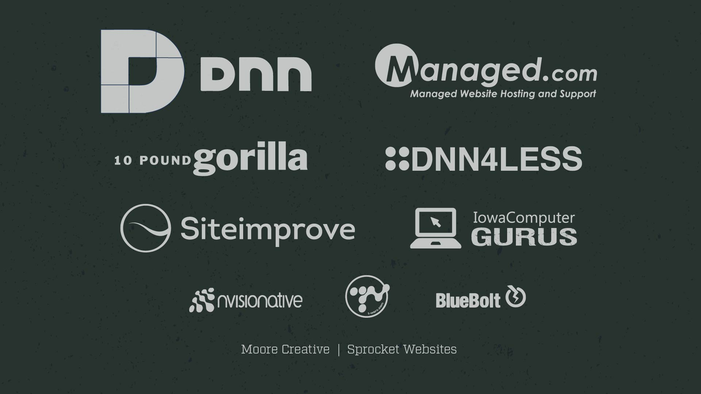
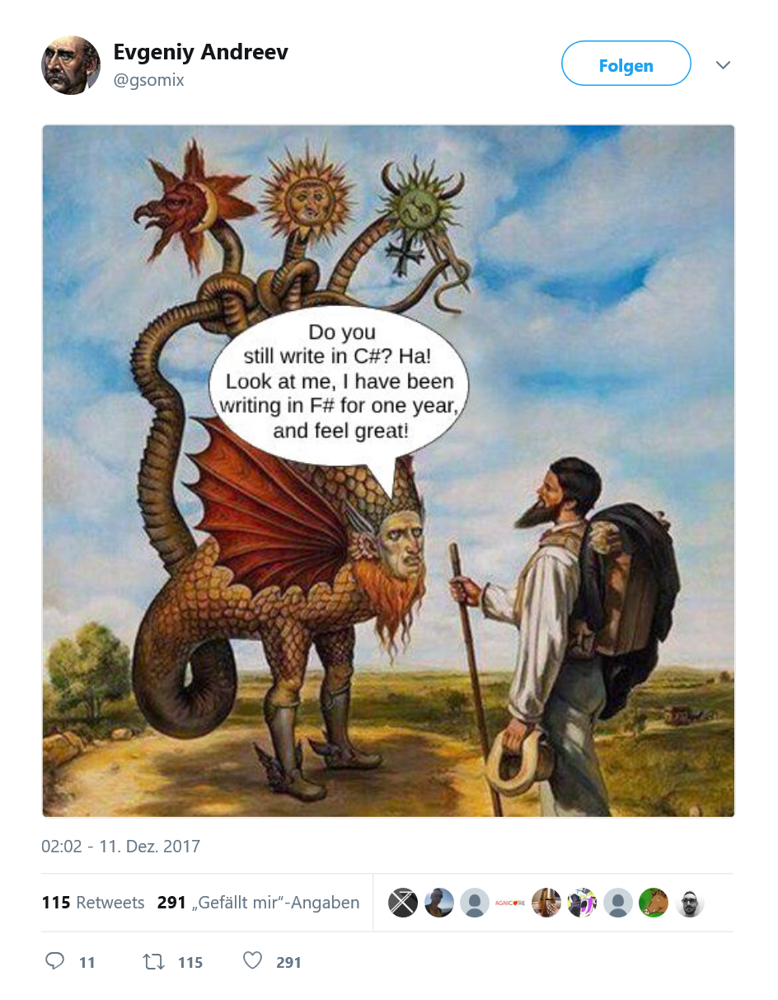
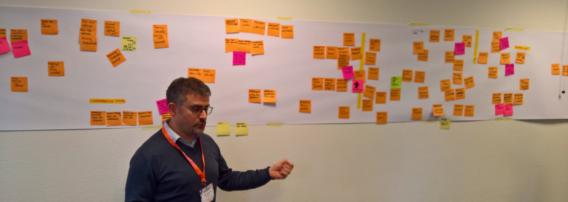
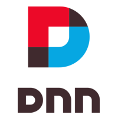

- title : F# |> DNN
- author : Stefan Cullmann
- theme : night
- transition : default

***


---



***

## F# |> DNN

<br />
<br />
### Using F# for DNN development
#### (With a focus on Fable/Elmish)
<br />
<br />
Stefan Cullmann   
<br />
Berlin, Germany

---
 

 * I am not an F# Expert 

---

### My Job

* Head of IT 
* Very small team
* Inhouse development only
    * Training & qualification 
    * Certification
    * Conferences and Seminars

---


* Focus on solving problems
* Exploring and analysing the business domain
* Adapting and improving business processes

---

* Software development is a learning process,    
working code is a side effect
* Focus on the core domain
* Keep the implementation as close as possible to your understanding



---


* DNN is still an awesome application host
* Put separate concerns/ bounded contexts into own modules

* Avoid coding outside your core domain and 
use existing tools whenever reasonable, e.g.
   * 2sxc Content, 
   * Open Content, 
   * DNN-Sharp tools,
   * Liquid Content,

***


## F# Basics

---

* General purpose programming language
* Functional-*first*
* Powerful type system
* Awesome data manipulation capabilities
* Leads to the "pit of success"

---

#### The Mountain of Doom


---

#### The Pit of Success


---

| C# / VB .NET | F#
|-:|:-
| Mutable by default | Immutable by default
| Side-effects + statements | Expressions
| Classes | Functions as values
| Inheritance | Composition
| State | Data + pure functions
| Polymorphism | Algebraic Data Types

---

## What does it mean?

1. It is easy to learn
1. It is **very** typesafe
1. It encorurages experimentation
1. It can be very intuitive
1. It shuns ceremony
1. Easier to test
1. Very friendly Community
1. It will open your mind to possibilities

Source: [Eight reasons to learn F#](https://medium.com/real-world-fsharp/eight-reasons-to-learn-f-fcb2bef64d7a)

***


## F# Primer in < 5 minutes

---

### Values

```fsharp
// bind 5 to x
let x:int = 5

// type inference
let inferredX = 5

// functions are just values, don't need a class
let helloWorld(name) = sprintf "Hello, %s" name 

// type inference again
let text = helloWorld "DNN-Summit"
```

---

### Types

```fsharp

// Tuples are first class citizens in F#
let person = ("Stefan", 50)
let personShortHand = "Stefan", 50 // string * int
let name, age = personShortHand // decompose the tuple 

// Declaring a record
type Person = { Name : string; Age : int }

// Create an instance
let me = { Name = "Stefan"; Age = 50 }
printfn "%s is %d years old" me.Name me.Age
```
---

### Immutable by default

```fsharp
let a = 10
//a <- 20 // not allowed

let mutable y = 10 // need an extra keyword!
y <- 20 // ok 

let me = { Name = "Stefan"; Age = 50 }
//me.Age <- 20 // not allowed

//creates a new record based on an existing one
let youngerme = {me with Age = 20} 
```
--- 
### Classes

```fsharp
// Declaring a class
type Person (name:string, age:int)  =
    member val Name = name with get, set //auto properties 
    member val Age  = age  with get, set

let me = Person (Stefan, 50)
me.Age <- 20 // allowed
```

---

### More Types

```fsharp
open FSharp.Data.UnitSystems.SI.UnitSymbols

type Direction = North | South | East | West
type Weather =
    | Cold of temperature:float<C>
    | Sunny
    | Wet
    | Windy of Direction * windspeed:float<m/s>

// Create a weather value
let weather = Windy(North, 10.2<m/s>)

let (|Low|Medium|High|) speed =
    if speed > 10.<m/s> then High
    elif speed > 5<m/s>. then Medium
    else Low
```
---

### Exhaustive pattern matching

```fsharp
match weather with
| Cold temp when temp < 2.0<C> -> "Really cold!"
| Cold _ | Wet -> "Miserable weather!"
| Sunny -> "Nice weather"
| Windy (North, High) -> "High speed northernly wind!"
| Windy (South, _) -> "Blowing southwards"
| Windy _ -> "It's windy!"
```

---

### Pipelines

*Top ten most most popular counties for house sales*


---

### Asynchronous support

```fsharp
open System
open System.Net

let webPageSize = async {
    use wc = new WebClient()
    let! result = wc.AsyncDownloadString(Uri "http://www.dnn-connect.org")
    return result.Length }
```

---

### No nulls!


---

### Attention!


---

### Whitespace sensitive 

```fsharp
open System
    
let prettyPrintTime() =
    let time = DateTime.UtcNow
    printfn "It is now %d:%d" time.Hour time.Minute
```
---

### Equals is comparison!

```fsharp
let x = 5
x = 10 // false, COMPARISON!!!
```
---

### REPL

* Read, Evaluate, Print Loop
* No console applications needed
* Scripts
* Explore domain quickly
* Converts quickly to full-blown assemblies

***


## Fable

---

### Fable
* Fable is an F# to JavaScript compiler powered by Babel
* <a href="http://fable.io/repl" target="_blank">REPL</a>

---

*** 


## Fable-Elmish

<br/><br/>
#### Build Fable apps following the Elm architecture (Model View Update)

---
## Fable-Elmish

```powershell
# Install template
dotnet new -i Fable.Template.Elmish.React
# Create  project
dotnet new fable-elmish-react -n awesome
cd awesome
# Install npm dependencies
yarn install
cd src
# Install dotnet dependencies
dotnet restore
# Start Fable server and Webpack dev server
dotnet fable yarn-start
# In your browser, open: http://localhost:8080/
```

---
### Model - View - Update

#### "Elm - Architecture"

 


 <small>http://danielbachler.de/2016/02/11/berlinjs-talk-about-elm.html</small>


--- 

### Model - View - Update

    // MODEL

    type Model = int

    type Msg =
    | Increment
    | Decrement

    let init() : Model = 0

---

### Model - View - Update

    // VIEW

    let view model dispatch =
        div []
            [ button [ OnClick (fun _ -> dispatch Decrement) ] [ str "-" ]
              div [] [ str (model.ToString()) ]
              button [ OnClick (fun _ -> dispatch Increment) ] [ str "+" ] ]

---

### Model - View - Update

    // UPDATE

    let update (msg:Msg) (model:Model) =
        match msg with
        | Increment -> model + 1
        | Decrement -> model - 1

---

### Model - View - Update

    // wiring things up

    Program.mkSimple init update view
    |> Program.withConsoleTrace
    |> Program.withReact "elmish-app"
    |> Program.run

---


### Sub-Components

    // MODEL

    type Model = {
        Counters : Counter.Model list
    }

    type Msg = 
    | Insert
    | Remove
    | Modify of int * Counter.Msg

    let init() : Model =
        { Counters = [] }

---

### Sub-Components

    // VIEW

    let view model dispatch =
        let counterDispatch i msg = dispatch (Modify (i, msg))

        let counters =
            model.Counters
            |> List.mapi (fun i c -> Counter.view c (counterDispatch i)) 
        
        div [] [ 
            yield button [ OnClick (fun _ -> dispatch Remove) ] [  str "Remove" ]
            yield button [ OnClick (fun _ -> dispatch Insert) ] [ str "Add" ] 
            yield! counters ]

---

### Sub-Components

    // UPDATE

    let update (msg:Msg) (model:Model) =
        match msg with
        | Insert ->
            { Counters = Counter.init() :: model.Counters }
        | Remove ->
            { Counters = 
                match model.Counters with
                | [] -> []
                | x :: rest -> rest }
        | Modify (id, counterMsg) ->
            { Counters =
                model.Counters
                |> List.mapi (fun i counterModel -> 
                    if i = id then
                        Counter.update counterMsg counterModel
                    else
                        counterModel) }

---

### Sub-Components

# Demo

***



## And now within DNN

---
<br/><br/>
### DNN and F#?


---

### DNN and F#!


---

###  Simple DNN Spa module 

```

[AntiForgeryToken: {}]   
[JavaScript:{ 
   path: "http://localhost:8080/bundle.js", 
   provider:"DnnFormBottomProvider"}]
<div id="elmish-todo" data-moduleId = "[ModuleContext:ModuleId]"></div>

```

* During development, link to script on webpackageserver

---
## SPA? Or multiple SPAs on one page?

```

[AntiForgeryToken: {}]   
[JavaScript:{path: "http://localhost:8080/bundle.js", provider:"DnnFormBottomProvider"}]
<div class="elmish-module" data-moduleId = "[ModuleContext:ModuleId]"></div>

```

```
let runApp elementId =
    Program.mkSimple init update view
    |> Program.withReact elementId
    |> Program.run

let runApps className =
    let elements = document.getElementsByClassName className
    let runOnElement index  =
         let elementId =  sprintf "%s-%i" className index
         elements.[index].id <- elementId
         runApp elementId
    Seq.iter (runOnElement) [0 .. int elements.length - 1]

runApps "elmish-module"
```


---

## Modify webpack.config.js for HMR

```javascript

  module.exports = {
  devtool: "source-map",
  entry: resolve('./src/elmish.fsproj'),
  output: {
    filename: 'bundle.js',
    path: resolve('./public'),
    publicPath: 'http://localhost:8080/',
  },
  devServer: {
    contentBase: resolve('./public'),
    headers: { "Access-Control-Allow-Origin": "*" },
    port: 8080,
    hot: true,
    inline: true
  },
  ...
  ```
---
### JS-Interop with Dnn ServicesFramework

```
open Fable.Core

type IServicesFramework = 
  abstract getServiceRoot: string     -> string 
  abstract setModuleHeaders: obj      -> unit
  abstract getTabId : unit            -> int option
  abstract getModuleId : unit         -> int option 
  abstract getAntiForgeryValue : unit -> string option
  

[<Emit("window['$'].ServicesFramework($0)")>]
let ServiceFramework (moduleid:int) : IServicesFramework  = jsNative
```

---

## Use Fable.JsonConverter within WebApi

```
type FableConfigAttribute () =
  inherit System.Attribute()

  interface IControllerConfiguration with
    member __.Initialize ((controllerSettings:HttpControllerSettings), _) =
        let fableFormatter = 
           JsonMediaTypeFormatter ( 
             SerializerSettings = JsonSerializerSettings (
                Converters = [|Fable.JsonConverter()|]))
        controllerSettings.Formatters.Clear ()
        controllerSettings.Formatters.Add fableFormatter

[<FableConfig>]
type FableController () =
  inherit DnnApiController ()
```

*** 

### Thank you!

* https://fsprojects.github.io/Paket/ 
* https://fable.io
* https://github.com/fable-compiler/fable-elmish
* https://ionide.io
* https://fsprojects.github.io/SQLProvider/
* https://github.com/rspeele/Rezoom.SQL
* https://fsprojects.github.io/FSharp.Configuration/ResXProvider.html
* https://github.com/bentayloruk/vscode-html-elmish
* https://safe-stack.github.io/
* https://gitter.im/fable-compiler/Fable
* https://github.com/tonsky/FiraCode


----

